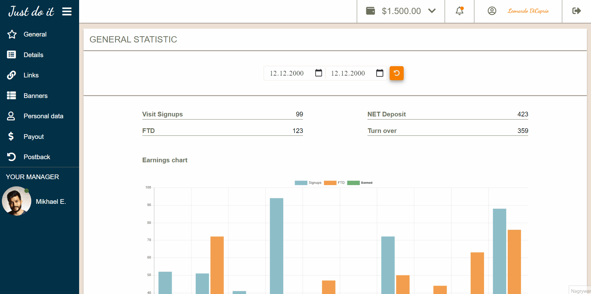

# DASHBOARD

DASHBOARD is simple HTML template.

## How it works

## Link
https://webster2020.github.io/Dashboard/

## Getting Started
1. git clone git@github.com:Webster2020/Dashboard.git
2. npm run install
3. npm run watch - run the project and than You can see it on Your device

*...or use link if You only want to check how it works

## Used technologies:
 1. HTML5 for content
 2. SCSS for extra styling

## Project architecture

 1. content in index.html file
 2. styles divided into subcatalogs with scss files 
 3. styleguide.html file with ready to use 'components'
 4. .gitignore with instruction to ignore files during commiting and pushing to remote repository
 5. package.json with scripts and installed packages
 6. eslintrc.json & stylelintrc.json with typing rules

## How did I create this project?

Project was prepared completely on the basis of graphic template.

## Authors

* **Michal Szwajgier** - *Webster2020* - 

## License
Free licence